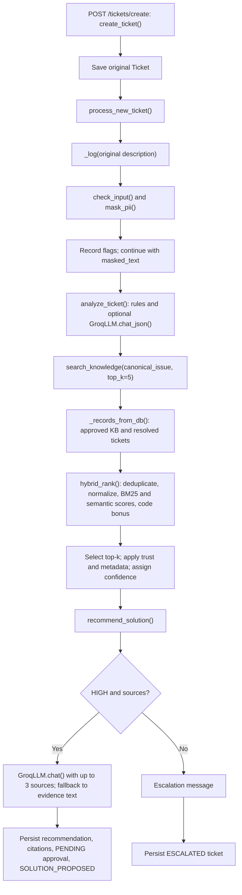

# Phase 1 component inventory

This document records **Phase 1 source inspection**. It describes the inspected implementation, not a successful runtime execution, attack, model download, or external LLM request. Paths are repository-relative; line references identify source evidence. Configuration values below are **source defaults**, not verified effective values. See baseline.md for separately recorded effective settings and runtime observations.

## Component inventory

| Component | File | Function/Class | Security/Relevance |
|---|---|---|---|
| Application entry point | app/main.py:20-35 | app; startup_event() | Creates FastAPI application, registers routers, and calls table creation on startup. The agents router is registered at line 28. |
| Ticket submission | app/routes/tickets.py:29-53 | create_ticket() | Checks for a signed-in user, saves original ticket text, then invokes the coordinator. |
| Ticket coordinator | app/agents/coordinator.py:11-95 | _log(); process_new_ticket() | Sequences security, analysis, retrieval and recommendation; persists logs, citations and final ticket state. |
| Security checks | app/agents/security_agent.py:4-25 | check_input() | Detects eight fixed suspicious substrings; returns allowed, flags and masked text. The coordinator records flags but continues processing. |
| PII masking | app/services/pii.py:3-14 | mask_pii() | Regex replacement for emails, selected phone numbers, IP-shaped strings and labeled secret values. Limited pattern-based masking. |
| Ticket intelligence | app/agents/ticket_agent.py:30-114 | _rule_category(); _rule_priority(); _entities(); analyze_ticket(); summarize_ticket_history() | Rules with optional LLM refinement. Validates category/priority against allowed labels, but accepts a nonempty LLM canonical issue after truncation. |
| Retrieval agent | app/agents/retrieval_agent.py:17-125 | _metadata_boost(); _trust_weight(); _records_from_db(); search_knowledge() | Selects eligible sources, retrieves, reranks the selected shortlist and assigns confidence labels. |
| BM25 retrieval | app/services/bm25.py:7-66 | tokenize(); BM25Search; BM25Search.scores() | Regex tokenization, lexical scoring and per-query min-max normalization. |
| Semantic retrieval | app/services/embeddings.py:9-44 | get_model(); get_document_embeddings(); encode_texts(); semantic_scores(); clear_document_embedding_cache() | SentenceTransformer embeddings, in-process caching and cosine similarity. |
| Hybrid ranking | app/services/hybrid_search.py:97-244 | normalize_query_for_search(); _extract_error_codes(); _deduplicate_records(); hybrid_rank() | Query preprocessing, deduplication, weighted lexical/semantic ranking and exact-code bonus. |
| Solution recommendation | app/agents/solution_agent.py:5-87 | recommend_solution() | Escalates non-HIGH retrieval; otherwise sends up to three sources to the LLM and returns explanation/citations. Prompt instructions are not output validation. |
| External LLM wrapper | app/services/llm.py:9-37 | GroqLLM; chat(); chat_json() | Sends system/user messages to Groq. JSON parsing does not itself enforce the expected application schema. |
| Direct agent endpoints | app/routes/agents.py:14-40 | security_check(); ticket_analyze(); retrieval_search(); solution_recommend(); knowledge_analyze() | Exposes individual agent functions. These route definitions do not declare authentication dependencies. solution_recommend() accepts a caller-supplied retrieval dictionary. Runtime exposure requires separate verification. |
| Chat endpoint | app/routes/chat.py:17-106 | _approved_records(); _fallback_answer(); chat_message() | Checks active login and flagged messages, then calls hybrid_rank() directly. Retrieval and confidence behavior differ from ticket processing. |
| Knowledge-health analysis | app/agents/knowledge_intelligence_agent.py:10-88 | analyze_knowledge_health() | Category coverage and optional KMeans clustering; a process-global 300-second cache. Above 60 tickets, coverage uses article-count heuristics instead of retrieval. |
| Authentication entry points | app/routes/auth.py:26-203 | current_user_from_request(); register(); login(); logout(); forgot_password(); reset_password() | Identity and account lifecycle dependencies. This inventory does not claim complete authentication assurance. |
| Authentication helpers | app/services/auth.py:13-32 | hash_password(); verify_password(); create_access_token(); decode_access_token() | Password and session-token helper boundary. |
| Support resolution | app/routes/support.py:13-75 | _require_support(); resolve_ticket() | Saves approved resolution data and optionally generates a draft article. Resolved tickets become eligible retrieval sources. |
| Knowledge maintenance | app/routes/knowledge.py:14-72; app/routes/admin.py:168-215 | _analyst_user(); update_article(); approve_article(); create_article(); delete_article() | Controls content and status of knowledge available to retrieval. |
| Database access | app/database.py:5-15 | engine; create_db_and_tables(); get_session() | SQLModel sessions using configured connection details. Effective database configuration is recorded separately. |
| Stored records | app/models.py:25-129 | Ticket; TicketCitation; KnowledgeArticle; AgentLog; SecurityEvent | Raw/masked descriptions, recommendations, source references, knowledge content and audit events. |
| Payload schemas | app/schemas.py:10-57 | ChatMessageRequest; AgentMessage; RetrievalItem; RetrievalResponse | Payload structure. A defined model does not prove a route uses it: the direct retrieval route returns a dictionary without declaring RetrievalResponse. |
| Ticket result view | app/main.py:70-105; app/templates/ticket_result.html:35-95 | ticket_result(); Jinja template | Displays confidence, sources, recommendation and explanation. Component retrieval scores are not displayed. |
| Offline IR evaluation | evaluation/evaluate_ir.py:16-106 | load_kb(); load_gold(); rank_indices(); metrics_for_query(); evaluate(); per_query_detail() | Evaluates CSV-based BM25/semantic/weighted-hybrid ranking, not the complete application retrieval pipeline. |

## Actual ticket architecture

The agents are Python functions called by the coordinator, rather than independently scheduled services.

Evidence: app/routes/tickets.py:29-53; app/agents/coordinator.py:24-95; app/agents/retrieval_agent.py:56-125; app/agents/solution_agent.py:9-86.

The coordinator logs original text before masking (coordinator.py:27-28). Flags create a SecurityEvent but do not stop this ticket flow (30-42). Retrieval uses the canonical issue rather than the original description or separately extracted entities (53-54). The canonical issue is not explicitly checked to retain original error codes.

The separate /chat/message path checks active login and flagged input, retrieves approved articles through hybrid_rank(message, top_k=3), and generates an answer. It does not call search_knowledge(), include resolved tickets, apply metadata/trust reranking, or use ticket confidence thresholds. It labels any nonempty result set HIGH (app/routes/chat.py:47-60, 105). Retrieval and the LLM prompt use the original message/history rather than returned masked_text (60, 85-98).

## Implemented retrieval features

| Feature | Actual implementation | Evidence and limitation |
|---|---|---|
| Technical tokenization | Selected punctuation inside identifiers and hexadecimal codes; lowercasing; slash-component splitting. | app/services/bm25.py:7-47. Query preprocessing strips some punctuation first. No stemming/lemmatization is implemented here. |
| Query preprocessing | Selected typo, abbreviation and phrase replacement; filler removal; corpus-vocabulary fuzzy correction; hexadecimal preservation; token deduplication. | app/services/hybrid_search.py:13-153. Rule-based rewriting can change meaning; for example, no internet becomes internet. |
| BM25 | BM25Okapi over title, content and category, min-max normalized. | app/services/bm25.py:50-66; app/services/hybrid_search.py:209,214. Equal raw scores become zeros. Index rebuilt each call. |
| Semantic search | all-MiniLM-L6-v2, normalized embeddings and cosine similarity clipped to [0,1]. | app/services/embeddings.py:9-24,37-44. Model availability and quality require runtime evidence. |
| Hybrid weights | Weighted sum of lexical and semantic scores. | app/services/hybrid_search.py:217-220; source defaults in app/config.py:16-17. |
| Exact-code boost | Adds 0.35 for a matching hexadecimal code in title, content, category or supported OS. | app/services/hybrid_search.py:156-159,222-230. Not general exact matching of all technical identifiers. |
| Deduplication | Keeps first normalized-title/content match; same-category content-word Jaccard similarity at least 0.9 also causes removal. | app/services/hybrid_search.py:162-208. Runs before trust weighting; does not select the most authoritative duplicate. |
| Eligibility filtering | Approved articles and RESOLVED tickets with nonblank resolution notes. | app/agents/retrieval_agent.py:56-89. No security-class or per-user source filter in this function. |
| Metadata reranking | Category substring bonus, selected OS bonuses and approved/resolved status bonus. | app/agents/retrieval_agent.py:17-40. Boosts, not category/OS exclusion filters. |
| Source trust | Multiplier derived from status/source type. | app/agents/retrieval_agent.py:43-53. KnowledgeArticle.authoritative and security_class are not copied into retrieval records or used here. |
| Confidence | HIGH/UNCERTAIN/LOW from highest adjusted score. | app/agents/retrieval_agent.py:111-118. Bonuses can push scores above 1; not calibrated probabilities. |
| Explainability | Returned BM25, semantic, adjusted hybrid, source metadata and exact-code-match flag. | app/services/hybrid_search.py:239-242; app/agents/retrieval_agent.py:102-107. Individual bonuses/trust multiplier not separately returned. |
| Citations | Up to three sources attached to recommendation. | app/agents/solution_agent.py:30-33,74-86. No implemented verification that generated steps are supported by cited sources. |

Metadata and trust are applied **after initial top-k selection** (app/agents/retrieval_agent.py:94-110). A source outside that shortlist cannot be promoted by these adjustments.

## Settings and fixed parameters

The four environment-backed settings below are **defaults only**. app/config.py loads dotenv values and caches settings. Consult baseline.md for separately inspected effective values; do not infer them from these defaults.

| Setting/parameter | Source default or fixed value | Location | Meaning |
|---|---|---|---|
| HYBRID_BM25_WEIGHT | Default 0.45 | app/config.py:16 | Lexical contribution. |
| HYBRID_SEMANTIC_WEIGHT | Default 0.55 | app/config.py:17 | Semantic contribution. |
| HIGH_CONFIDENCE_THRESHOLD | Default 0.68 | app/config.py:18 | Ticket recommendation gate. |
| UNCERTAIN_THRESHOLD | Default 0.55 | app/config.py:19 | Lower boundary of UNCERTAIN. |
| Embedding model | Fixed all-MiniLM-L6-v2 | app/services/embeddings.py:11 | Semantic encoder. |
| Model cache | Fixed maximum 1 entry | app/services/embeddings.py:9 | Reuses model in one process. |
| Document embedding cache | Fixed maximum 128 entries | app/services/embeddings.py:14 | Each entry is a complete ordered document-text tuple. |
| Fuzzy cutoff | Fixed 0.72 | app/services/hybrid_search.py:139 | Minimum get_close_matches() similarity. |
| Exact-code bonus | Fixed 0.35 | app/services/hybrid_search.py:223 | Added before initial top-k. |
| Deduplication threshold | Default 0.9 | app/services/hybrid_search.py:162 | Same-category word-set similarity. |
| Category bonus | Fixed 0.18 | app/agents/retrieval_agent.py:24 | Query-token/category substring match. |
| OS bonuses | Fixed 0.18 / 0.15 / 0.14 | app/agents/retrieval_agent.py:28-35 | Selected Windows 11 / Windows 10 / Ubuntu or macOS matches. |
| Approved/resolved bonus | Fixed 0.08 | app/agents/retrieval_agent.py:37-38 | Added after trust multiplication. |
| Source trust | Fixed 0 / 1 / 0.85 / 0.7 | app/agents/retrieval_agent.py:47-53 | Draft / approved or internal KB / resolved / other. |
| Ticket shortlist | Fixed call value 5 | app/agents/coordinator.py:54 | Initial maximum results. |
| Recommendation evidence | Fixed first 3 results | app/agents/solution_agent.py:30 | Sources supplied to generation. |
| Chat shortlist | Fixed call value 3 | app/routes/chat.py:60 | Separate chat retrieval. |
| Knowledge-health cache | Fixed 300 seconds | app/agents/knowledge_intelligence_agent.py:12 | Global report cache within a process. |

## Cache and UI visibility gaps

- Document embeddings are cached in memory by the entire ordered document-text tuple. Query embeddings are recomputed. A document-text change changes the cache key and triggers new embeddings, so absence of cache clearing in article routes does not itself prove stale search results.
- clear_document_embedding_cache() exists, but references outside its definition were found only in tests. Previous corpus versions can remain cached until eviction, explicit clearing or process exit.
- Knowledge-health caching is separate: one global result is returned for up to 300 seconds without a dataset key (app/agents/knowledge_intelligence_agent.py:10-23,86-88). Its freshness properties differ from the embedding cache.
- Retrieval API dictionaries expose component scores. The ticket workflow persists only citation relevance_score, source metadata and rank (app/models.py:75-84; app/agents/coordinator.py:64-73), losing the BM25/semantic breakdown from structured citation storage.
- The ticket UI displays percentage confidence, explanation, source IDs and relevance, but not normalized query, component scores, exact-code bonus, metadata bonus or trust multiplier (app/templates/ticket_result.html:35-95).
- The ticket template multiplies confidence/relevance by 100 without clamping (app/templates/ticket_result.html:5,47-48,90). The solution explanation separately clamps its displayed score to 100 (app/agents/solution_agent.py:37), so presentation can differ.
- The UI label Verified source and the explanation's validation wording are presentation text, not independent source verification.
- The displayed agent trace is selected by matching canonical_issue[:40] within global log summaries rather than by request ID (app/main.py:80-81). This may produce an incomplete or ambiguous trace; this source observation is not a tested runtime instance.
- Offline evaluation uses CSV articles, raw queries and hardcoded weights 0.45/0.55 (evaluation/evaluate_ir.py:16-47). It omits application normalization, deduplication, code bonuses, metadata/trust reranking, resolved-ticket sources and confidence gating. Its metrics describe that baseline, not the complete application retrieval path.

## Evidence limits

This document establishes implementation presence and source-level data flow. It does not establish attack success, model reliability, effective environment settings, deployed authentication behavior, cache hits or test results. Runtime observations and actual metric results belong in the separately recorded baseline evidence.
